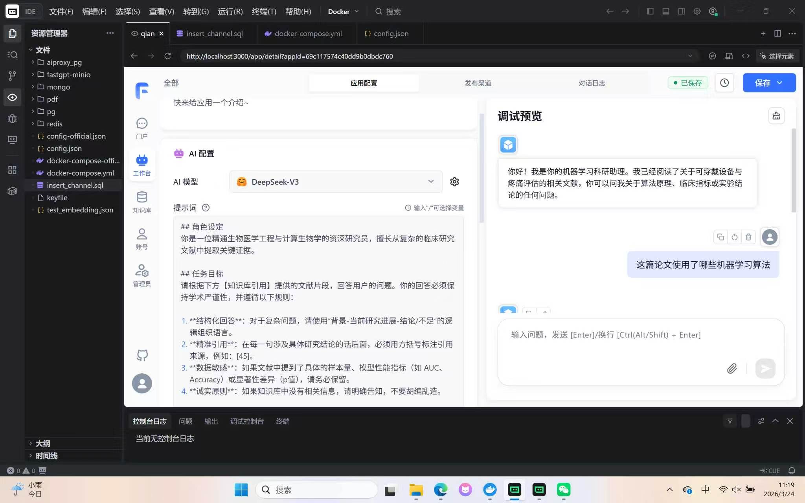
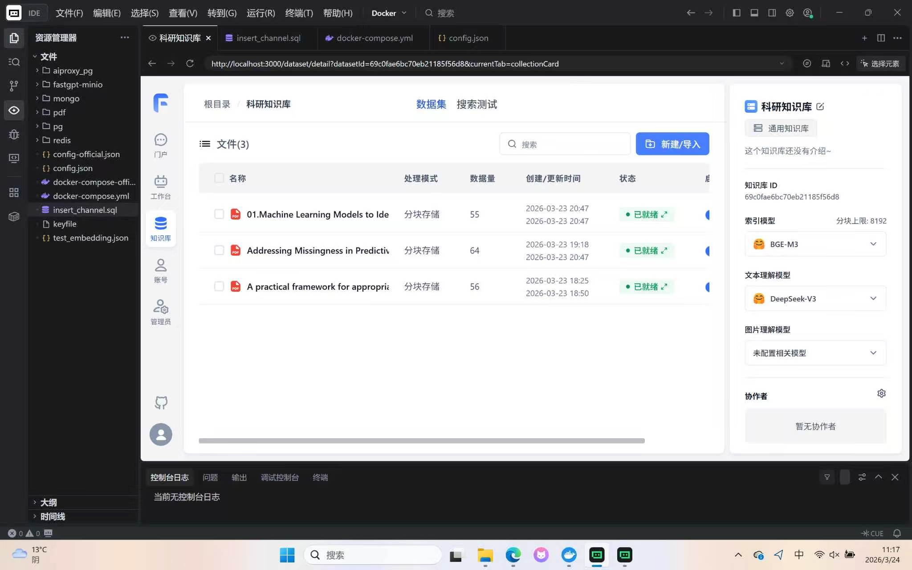

# MedRAG-Nexus

基于FastGPT的医学文献智能问答系统，利用RAG技术实现医学文献的语义检索与智能问答。

## 项目简介

MedRAG-Nexus是一个面向医学领域的RAG（检索增强生成）系统，支持医生上传医学文献PDF，通过自然语言提问获取相关文献内容，并获得带有引用来源的智能回答。

## 技术架构

```
┌─────────────────────────────────────────────────────────────┐
│                      FastGPT (Port 3000)                     │
│                    RAG工作流引擎                              │
└─────────────────────┬───────────────────────────────────────┘
                      │
        ┌─────────────┼─────────────┐
        │             │             │
        ▼             ▼             ▼
┌───────────┐  ┌───────────┐  ┌───────────┐
│  MongoDB  │  │PostgreSQL │  │   Redis   │
│  数据存储  │  │ (pgvector)│  │   缓存    │
│  副本集   │  │  向量存储  │  │   队列    │
└───────────┘  └───────────┘  └───────────┘
        │
        ▼
┌───────────┐      ┌───────────────────────┐
│   MinIO   │      │   SiliconFlow API     │
│ S3对象存储 │      │  BAAI/bge-m3 向量模型  │
│  PDF存储  │      │  DeepSeek-V3 LLM      │
└───────────┘      └───────────────────────┘
```

## 技术栈

| 组件 | 技术选型 | 说明 |
|------|----------|------|
| RAG引擎 | FastGPT | 开源RAG工作流平台 |
| 向量模型 | BAAI/bge-m3 | 多语言嵌入模型，1024维向量 |
| LLM | DeepSeek-V3 | 大语言模型，生成回答 |
| 向量数据库 | PostgreSQL + pgvector | 向量存储与检索 |
| 主数据库 | MongoDB 5.0 | 业务数据存储，副本集模式 |
| 缓存 | Redis 7 | 任务队列、缓存管理 |
| 对象存储 | MinIO | S3兼容存储，存放PDF文件 |
| 容器编排 | Docker Compose | 服务编排与管理 |

## 核心功能

- **知识库管理**：上传PDF文档，自动解析与分块
- **向量嵌入**：使用BAAI/bge-m3模型进行文档向量化
- **语义检索**：基于向量相似度的智能检索
- **智能问答**：结合检索结果生成带引用的回答
- **多科室支持**：支持不同科室医学文献分类管理

## 项目截图

### 知识库管理界面


### 文档训练状态


## 当前进展

- [x] Docker Compose服务编排配置
- [x] MongoDB副本集认证配置
- [x] PostgreSQL pgvector向量扩展部署
- [x] Redis缓存服务配置
- [x] MinIO对象存储配置
- [x] FastGPT主服务部署
- [x] 向量模型(BAAI/bge-m3)配置
- [x] LLM模型(DeepSeek-V3)配置
- [x] 知识库创建与文档上传
- [x] PDF文档向量嵌入训练
- [ ] RAG问答工作流测试
- [ ] 多科室文献分类功能
- [ ] 用户权限管理
- [ ] API接口开发

## 快速开始

### 环境要求

- Docker 20.10+
- Docker Compose 2.0+
- 8GB+ 内存

### 部署步骤

1. 克隆项目
```bash
git clone git@github.com:YiHarvest/MedRAG-Nexus.git
cd MedRAG-Nexus
```

2. 配置环境变量
```bash
cp .env.example .env
# 编辑.env文件，配置API密钥等敏感信息
```

3. 启动服务
```bash
docker-compose up -d
```

4. 初始化MongoDB副本集
```bash
docker exec -it mongo mongosh -u myusername -p mypassword --authenticationDatabase admin --eval "rs.initiate({_id: 'rs0', members: [{_id: 0, host: 'mongo:27017'}]})"
```

5. 访问系统
- FastGPT界面: http://localhost:3000
- MinIO控制台: http://localhost:9001

## 遇到的技术问题与解决方案

### 1. MongoDB副本集认证
**问题**：启用认证后副本集启动失败
**解决**：生成keyfile并配置到所有节点，实现内部认证

### 2. Embedding API路径
**问题**：API调用返回404错误
**解决**：配置完整的API端点路径`/v1/embeddings`

### 3. 容器网络通信
**问题**：服务间无法通信
**解决**：使用Docker服务名替代localhost进行容器间通信

### 4. MinIO存储桶初始化
**问题**：FastGPT启动时找不到存储桶
**解决**：添加初始化容器自动创建所需存储桶

## 技术亮点

1. **完整的RAG架构**：从文档上传到智能问答的完整流程
2. **向量检索**：使用pgvector实现高效的语义相似度检索
3. **高可用设计**：MongoDB副本集保证数据可靠性
4. **容器化部署**：一键部署，环境隔离，易于迁移

## 后续规划

- [ ] 集成更多医学专业模型
- [ ] 添加文献引用格式化功能
- [ ] 实现多轮对话上下文管理
- [ ] 开发REST API接口
- [ ] 添加用户使用统计功能

## License

MIT License

## 联系方式

如有问题或建议，欢迎提交Issue或Pull Request。
